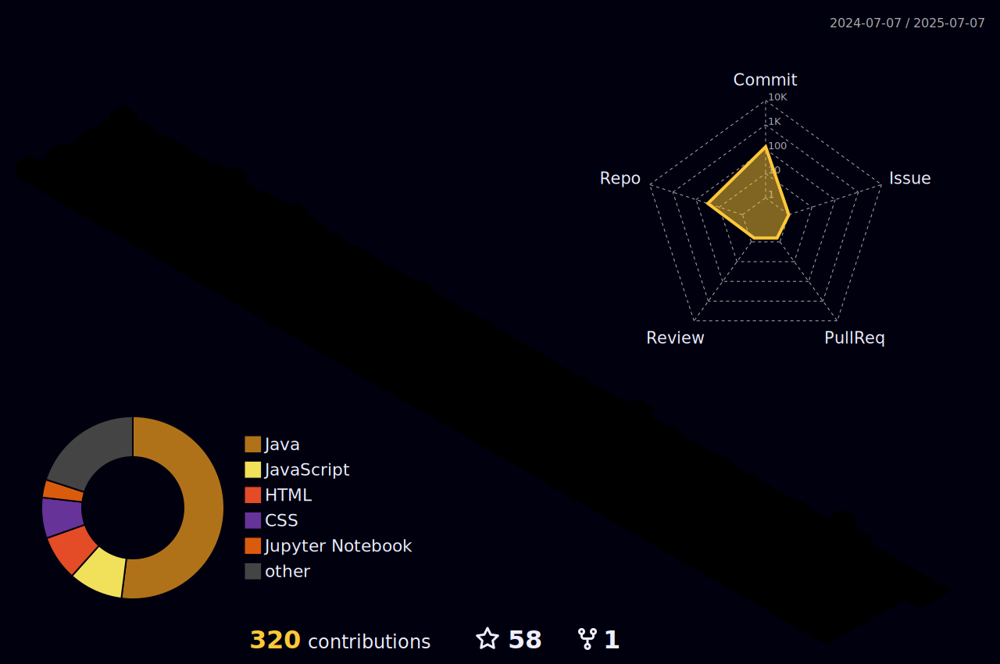
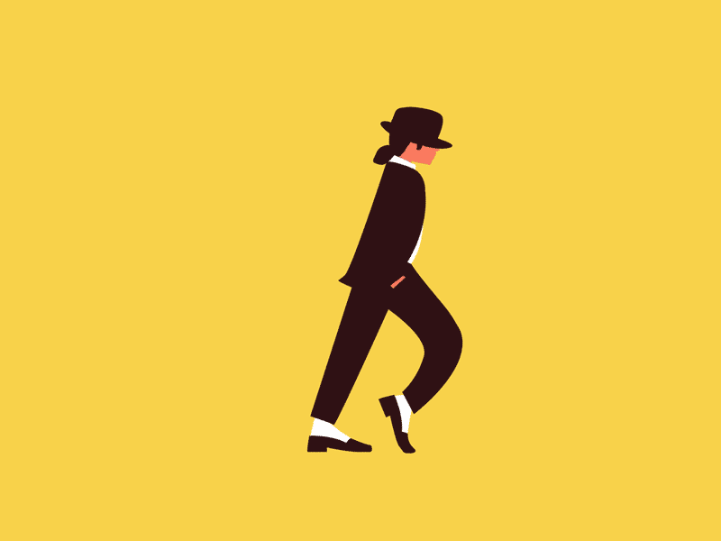

<h1 align="center">Hey  it's Upek,</h1>

- Bsc (Hons) Full-Stack Software Engineering Undergraduate.
- Passionate for Web-Application Development.
- Experience in Project Management, Team Leading as well as UX designing.

Welcome to my GitHub portfolio, where you'll find a collection of my projects showcasing my skills and passion for software development. _Let's Empower your business by Transform ideas into reality together!_

 

### _Currently learning ! 📚:_

   

   <!--  -->
   

 

### _Github Stats! 👨‍💻:_

<!--
|  | 
&nbsp;
 |
| ------------------------------------------------------------------------------------------------------------------------------------ | ---------------------------------------------------------------------------------------------------------------------------------------------------------------------------------------------------- |
-->
 

 

### _Reach me! 💬:_

  &nbsp; &nbsp; &nbsp; &nbsp;

 

### _Tech-stack 💻:_

 

### _IDEs & other tools 🛠️:_

 

### _Word from me! ✍️:_

 

### _Support Me ❤️_

<!--  -->

&nbsp;&nbsp;&nbsp;&nbsp;&nbsp;&nbsp;&nbsp;

