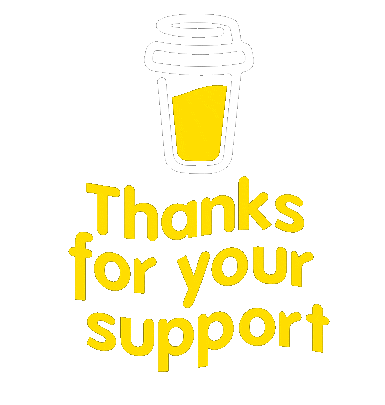

<h2 align="center">Hey  it's Upek,</h2>

- Bsc (Hons) Full-Stack Software Engineering Undergraduate.
- Passionate for Web-Application Development.
- Experience in Project Management, Team Leading as well as UX designing.

Welcome to my GitHub portfolio, where you'll find a collection of my projects showcasing my skills and passion for software development. _Let's Empower your business by Transform ideas into reality together!_

 

### Currently learning ! 📚:

 

### Reach me! 💬:

### Programming Languages & Tools 💻:

  
  
  &nbsp;
  
  &nbsp;
  
  &nbsp;
  
  &nbsp;
  
  &nbsp;
  
  &nbsp;
  
  &nbsp;
  
  &nbsp;
  
  &nbsp;
  
  &nbsp; 
  
  &nbsp;
  

  
  
  &nbsp;
  
  &nbsp;
  
  &nbsp;
  
  &nbsp;
  
  &nbsp;
  
  &nbsp;
  
  &nbsp;
  
  &nbsp;
  
  &nbsp;
  

### Support Me 🤝🫶:

 
&nbsp;&nbsp;&nbsp;&nbsp;&nbsp;&nbsp;&nbsp;

|  | 
&nbsp;
 |
| ------------------------------------------------------------------------------------------------------------------------------------ | ---------------------------------------------------------------------------------------------------------------------------------------------------------------------------------------------------- |
